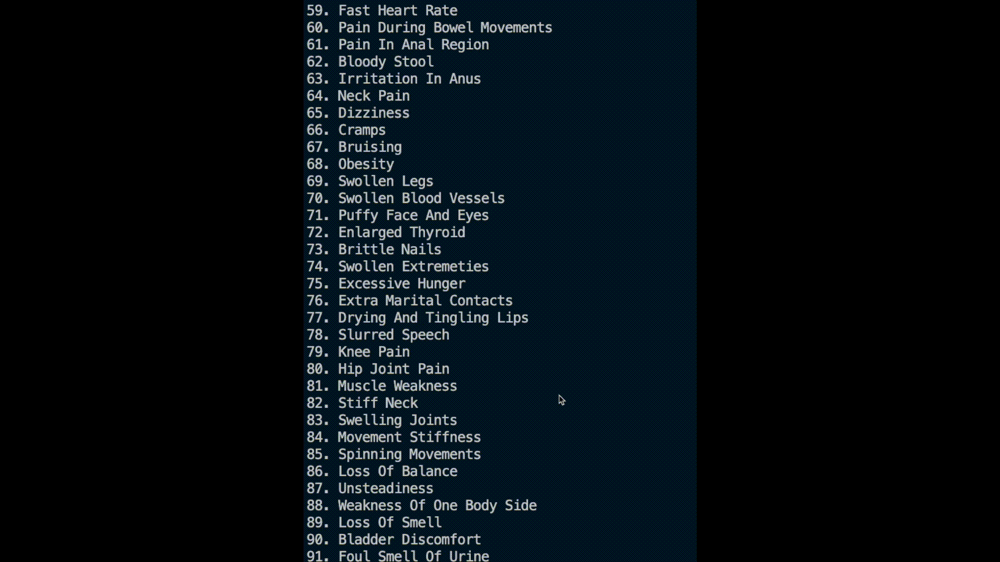

# Disease Prediction Using Machine Learning

A machine learning-based disease prediction system that uses symptoms to predict possible diseases. The model utilizes an ensemble approach combining Support Vector Classifier (SVC), Gaussian Naive Bayes, and Random Forest Classifier for accurate predictions.

# Features

- Data preprocessing and cleaning
- Multiple machine learning models implementation
- Model evaluation using k-fold cross-validation
- Ensemble learning with voting classifier
- Interactive terminal application interface for predictions
- Visualization of data distributions and model performance

# Dataset
The dataset used in this project is available in the data directory and includes:

training.csv: Training data with symptoms and corresponding diseases.
testing.csv: Testing data for model evaluation.

132 different symptoms as features
Multiple disease categories as target variables
Balanced distribution of disease cases
Source: Kaggle Disease Prediction Dataset

# Model Performance

Cross-validation accuracy: 99%
Test set accuracy: 99%
Ensemble model combines predictions from:
    Support Vector Classifier
    Gaussian Naive Bayes
    Random Forest Classifier 

# License
This project is licensed under the GNU General Public License v3.0. See the LICENSE file for details.

